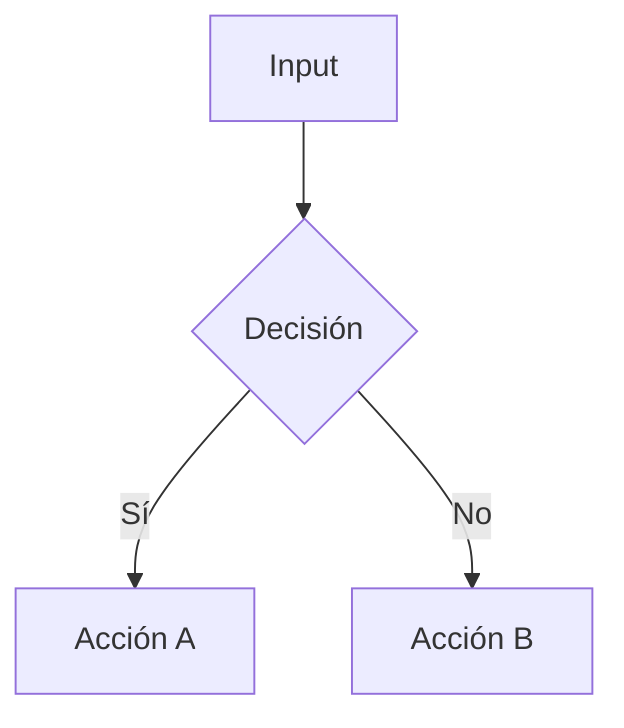

# 🤖 Sistema de Agentes de IA — WhatsApp Bot Platform

> **Versión:** 1.0  
> **Última actualización:** Enero 2025  
> **Compatibilidad:** Cualquier LLM (Claude, ChatGPT, Copilot, Gemini, Qwen, etc.)

---

## 📋 ¿Qué es este sistema?

Este documento define un **sistema de agentes especializados** diseñado para asistir en el desarrollo, mantenimiento y evolución de la plataforma WhatsApp Bot. Cada agente tiene un rol específico, límites claros y entregables medibles.

**Objetivo:** Permitir que cualquier modelo de lenguaje (LLM) pueda asumir un rol específico y contribuir de manera consistente al proyecto, respetando la arquitectura existente y el roadmap definido.

---

## 🎯 Reglas de Oro

### 1. **No inventar capacidades**
Los agentes solo deben trabajar con lo que **existe actualmente**:
- WhatsApp: enviar/recibir mensajes con Baileys
- Flujo: `BotService` → `BotOrchestrator` → `QASearchAgent`/`GeminiAgent` → Escalación
- Socket.IO hacia Dashboard React
- `BotAssignmentService` (configuración por chat)
- `PendingAlertService` (alertas + respuesta humana)
- Knowledge Base en JSON (archivo local)

### 2. **Control humano siempre**
- Ningún agente puede hacer merge sin revisión humana
- Las decisiones arquitectónicas requieren aprobación (ADR)
- El código generado debe ser revisado antes de integrar

### 3. **Trazabilidad obligatoria**
- Todo cambio debe referenciar: Issue, PR, o ADR
- Los agentes deben documentar sus decisiones
- Usar formato estándar para outputs (Mermaid, Markdown, JSON)

### 4. **Anti-spam y rate limiting**
- No generar código duplicado
- No crear archivos innecesarios
- Respetar los límites de la API de WhatsApp
- Implementar protección anti-loop en cualquier flujo automático

### 5. **Seguridad primero**
- Nunca hardcodear credenciales
- Validar todos los inputs
- Sanitizar datos antes de persistir
- No exponer información sensible en logs

---

## 🗂️ Índice de Agentes

| # | Agente | Archivo | Rol Principal |
|---|--------|---------|---------------|
| 00 | **Orquestador** | [/agents/00-ORCHESTRATOR.md](./agents/00-ORCHESTRATOR.md) | Program Manager + Tech Lead |
| 01 | **Arquitecto** | [/agents/01-ARCHITECT.md](./agents/01-ARCHITECT.md) | Diseño de sistemas y ADRs |
| 02 | **UI/UX** | [/agents/02-UI-UX.md](./agents/02-UI-UX.md) | Diseño de interfaces |
| 03 | **Knowledge Base** | [/agents/03-KNOWLEDGE_BASE.md](./agents/03-KNOWLEDGE_BASE.md) | Gestión de KB y FAQs |
| 04 | **DevOps** | [/agents/04-DEVOPS.md](./agents/04-DEVOPS.md) | CI/CD, deploy, infraestructura |
| 05 | **Revisor** | [/agents/05-REVIEWER.md](./agents/05-REVIEWER.md) | Code review y calidad |
| 06 | **Documentador** | [/agents/06-DOCUMENTER.md](./agents/06-DOCUMENTER.md) | Technical writing |
| 07 | **Tester** | [/agents/07-TESTER.md](./agents/07-TESTER.md) | QA y testing |
| 08 | **Developer** | [/agents/08-DEVELOPER.md](./agents/08-DEVELOPER.md) | Implementación de código y features |

---

## 📅 Mapa de Agentes por Fase del Roadmap

### Fase A: MVP Operable
> Alerts + KB CRUD + BotAssignment + Inbox

| Agente | Responsabilidad |
|--------|-----------------|
| Orquestador | Planificar sprints, priorizar tareas |
| Developer | Implementar CRUD de KB, mejorar Inbox |
| UI/UX | Diseñar interfaz de alertas y KB |
| Tester | Tests de integración para flujo completo |
| Documentador | Documentar APIs y flujos |

### Fase B: Broadcast + Groups
> Mensajes masivos y gestión de grupos

| Agente | Responsabilidad |
|--------|-----------------|
| Arquitecto | Diseñar sistema de broadcast con rate limiting |
| Developer | Implementar broadcast service |
| DevOps | Configurar colas de mensajes (si aplica) |
| Tester | Tests de carga y rate limiting |

### Fase C: IA con Barandillas
> Mejoras en respuestas automáticas

| Agente | Responsabilidad |
|--------|-----------------|
| Knowledge Base | Expandir KB, crear variaciones |
| Arquitecto | Definir límites y fallbacks de IA |
| Developer | Implementar guardrails |
| Tester | Tests de edge cases en IA |

### Fase D: Automatizaciones
> Flujos automáticos y triggers

| Agente | Responsabilidad |
|--------|-----------------|
| Arquitecto | Diseñar sistema de workflows |
| Developer | Implementar engine de automatización |
| UI/UX | Diseñar builder visual de flujos |
| Tester | Tests de flujos complejos |

### Fase E: Institution-Ready
> Auth, roles, DB, deploy

| Agente | Responsabilidad |
|--------|-----------------|
| Arquitecto | Diseñar sistema de auth y roles |
| DevOps | Configurar deploy production-ready |
| Developer | Migrar a base de datos |
| Revisor | Auditoría de seguridad |

---

## 🚀 Cómo Invocar un Agente

### Formato de invocación
```
/[agente] [contexto o tarea específica]
```

### Ejemplos prácticos

```markdown
/orquestador Planifica las tareas para completar Fase A del roadmap

/architect Diseña el sistema de broadcast con rate limiting para Fase B

/developer Implementa el CRUD completo para Knowledge Base

/tester Crea un plan de tests para el flujo de escalación de alertas

/reviewer Revisa el PR #123 que implementa el servicio de broadcast

/documenter Documenta la API de alertas con ejemplos de uso

/kb Crea 10 variaciones de preguntas para la categoría "horarios"

/devops Configura el pipeline de CI/CD para el proyecto

/uiux Diseña el flujo de usuario para responder alertas desde el dashboard
```

---

## ✅ Checklist Universal Pre-Merge

Antes de hacer merge de cualquier PR, verificar:

### Código
- [ ] TypeScript compila sin errores (`npm run build`)
- [ ] Linter pasa sin warnings (`npm run lint`)
- [ ] No hay `console.log` de debug
- [ ] No hay credenciales hardcodeadas
- [ ] Imports ordenados y sin duplicados

### Funcionalidad
- [ ] Feature funciona según especificación
- [ ] Edge cases manejados
- [ ] Errores tienen mensajes claros
- [ ] Anti-loop implementado si aplica
- [ ] Rate limiting respetado si aplica

### Tests
- [ ] Tests unitarios pasan
- [ ] Tests de integración pasan (si existen)
- [ ] Cobertura no decrece

### Documentación
- [ ] README actualizado si cambia setup
- [ ] API documentada si hay endpoints nuevos
- [ ] Comentarios en código complejo
- [ ] CHANGELOG actualizado

### Seguridad
- [ ] Inputs validados
- [ ] No hay SQL injection / XSS
- [ ] Datos sensibles no expuestos en logs
- [ ] Permisos verificados

---

## 📄 Convención de Outputs

### Diagramas → Mermaid


### Decisiones arquitectónicas → ADR
Ver template en: [/docs/adrs/ADR_TEMPLATE.md](./docs/adrs/ADR_TEMPLATE.md)

### Documentación técnica → Markdown
Ver template en: [/docs/templates/DOC_TEMPLATE.md](./docs/templates/DOC_TEMPLATE.md)

### Plans de test → Checklist
Ver template en: [/docs/templates/TEST_PLAN_TEMPLATE.md](./docs/templates/TEST_PLAN_TEMPLATE.md)

### PRs → Checklist estándar
Ver template en: [/docs/templates/PR_CHECKLIST.md](./docs/templates/PR_CHECKLIST.md)

### Entradas de KB → Formato estructurado
Ver template en: [/docs/templates/KB_ENTRY_TEMPLATE.md](./docs/templates/KB_ENTRY_TEMPLATE.md)

---

## 🔗 Referencias

- **Roadmap:** [ROADMAP.md](./ROADMAP.md)
- **Documentación técnica:** [/docs/TECHNICAL_DOCUMENTATION.md](./docs/TECHNICAL_DOCUMENTATION.md)
- **Guía de tono:** [/docs/TONE_GUIDE.md](./docs/TONE_GUIDE.md)
- **Plan de integración IA:** [/web/PLAN_INTEGRACION_IA.md](./web/PLAN_INTEGRACION_IA.md)

---

## ⚠️ Advertencias Importantes

1. **Este sistema es una guía, no un reemplazo del juicio humano**
2. **Los agentes pueden cometer errores** — siempre revisar outputs
3. **No usar para decisiones críticas de negocio sin supervisión**
4. **Mantener actualizado este documento conforme evoluciona el proyecto**

---

*Documento generado para ser compatible con cualquier LLM. Actualizar según evolucione el proyecto.*
