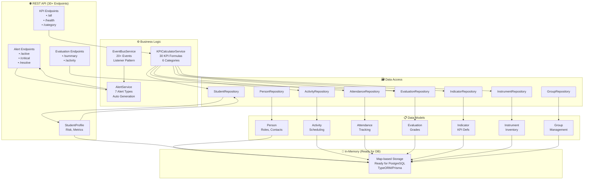

# 🏗️ Framework Architecture Diagram

## System Overview



---

## Database Schema (Ready for Implementation)

```typescript
// 8 Main Entities with Relationships

Person (1):M StudentProfile
Person (1):M Activity (as leaderId)
Person (1):M Attendance (as observer)
Person (1):M Evaluation (as teacher)

StudentProfile (1):M Attendance
StudentProfile (1):M Evaluation

Activity (1):M Attendance
Activity (1):M Evaluation
Activity (1):M Participation

Indicator (1):M IndicatorResult

Instrument (1):M InstrumentMaintenance

Group (1):M CommunicationAction
```

---

## KPI Calculation Pipeline

```
┌─────────────────────────────────────────────────────────┐
│          KPICalculatorService.calculateAllKPIs()        │
│                   (Triggered manually/scheduled)        │
└────────────────────┬────────────────────────────────────┘
                     │
        ┌────────────┴────────────┬─────────────┬─────────────┐
        │                         │             │             │
    ┌──▼──┐                  ┌───▼──┐     ┌───▼──┐       ┌──▼──┐
    │Data │                  │Data  │     │Data  │       │Data │
    │Fetch│                  │Trans │     │Calc  │       │Eval │
    │     │                  │Form  │     │      │       │     │
    └──┬──┘                  └───┬──┘     └───┬──┘       └──┬──┘
       │ Student/Activity       │ Rates     │ GPA       │ Pass/Fail
       │ Records                │ Counts    │ Averages  │
       │                        │           │           │
       └────────────┬───────────┴──────┬────┴──────┬─────┴──────┐
                    │                  │           │            │
              ┌─────▼────────────────────────────────────────────▼────┐
              │      Result Objects (IndicatorResult[])               │
              │  - indicatorId, valor, method, calculatedAt           │
              │  - isSuccessful, alert, notes, hash                   │
              └─────┬────────────────────────────────────────────────┘
                    │
        ┌───────────┴──────────────┐
        │                          │
    ┌───▼──────────────┐      ┌───▼──────────────────┐
    │ Event Emission   │      │ Result Persistence  │
    │ - INDICATOR_     │      │ - indicatorRepository
    │   CALCULATED     │      │   .saveResult()      │
    │ - INDICATOR_ALERT│      │ (for history/audit)  │
    └──────────────────┘      └────────────────────┘
```

---

## Event Flow Architecture

```
┌──────────────────────────────────────────────────────────────┐
│                      EventBusService                          │
│                                                               │
│  Listener Registry: Map<String, Set<Listener>>              │
│  Event History: FrameworkEvent[]                             │
└──────────────────────────────────────────────────────────────┘

        ▲                                         ▲
        │                                         │
        │ emit()                                 │ emitAsync()
        │ (sync)                                 │ (parallel)
        │                                         │
   ┌────┴─────────┐                    ┌────────┴──────┐
   │ Services     │                    │ Controllers   │
   │ trigger      │                    │ send          │
   │ events       │                    │ responses     │
   └──────────────┘                    └───────────────┘

Events Defined:
├── STUDENT_ (4)
│   ├── ENROLLED
│   ├── AT_RISK
│   ├── GRADUATED
│   └── DROPPED
├── ATTENDANCE_ (2)
│   ├── RECORDED
│   └── PATTERN_CHANGED
├── EVALUATION_ (2)
│   ├── COMPLETED
│   └── FAILED
├── ACTIVITY_ (4)
│   ├── CREATED
│   ├── STARTED
│   ├── COMPLETED
│   └── PARTICIPATION_RECORDED
├── INDICATOR_ (2)
│   ├── CALCULATED
│   └── ALERT
├── INSTRUMENT_ (2)
│   ├── ASSIGNED
│   └── MAINTENANCE_DUE
└── SYSTEM (3)
    ├── KPI_BATCH_COMPLETED
    ├── ALERT_GENERATED
    └── SYNC_COMPLETED
```

---

## Alert Generation Flow

```
┌──────────────────────────┐
│  Events from System      │
│  (STUDENT_AT_RISK, etc)  │
└────────┬─────────────────┘
         │
     ┌───▼──────────────────────┐
     │  AlertService Listeners  │
     │  - handleStudentAtRisk   │
     │  - handleEvalFailed      │
     │  - handleIndicatorAlert  │
     └────┬─────────────────────┘
          │
    ┌─────▼────────────────────────────────────────┐
    │  createAlert()                               │
    │  - type: AlertType                           │
    │  - severity: AlertSeverity (INFO|WARN|ERR|CRIT)
    │  - entity: (STUDENT|EVAL|INDICATOR|etc)      │
    │  - message: descriptive                      │
    │  - details: contextual data                  │
    └─────┬────────────────────────────────────────┘
         │
    ┌────▼─────────────────┐
    │ Alert Emission       │
    │ (broadcast)          │
    │ + add to storage     │
    │ + notify listeners   │
    └──────────────────────┘
```

---

## Request Flow Example: "Calculate All KPIs & Get Dashboard"

```
GET /api/framework/dashboard
│
├─► kpiCalculatorService.calculateAllKPIs()
│   ├─► studentRepository.getStatistics()
│   │   └─► Map.values() → analytics
│   ├─► attendanceRepository.getSummary()
│   ├─► evaluationRepository.getSummary()
│   ├─► activityRepository.getStatistics()
│   ├─► instrumentRepository.getStatistics()
│   └─► For each KPI formula:
│       └─► calculate() → IndicatorResult
│           ├─► emit(INDICATOR_CALCULATED)
│           └─► indicatorRepository.saveResult()
│
├─► alertService.getAlertSummary()
│   └─► Count by severity/type
│
└─► Response JSON with:
    {
      students: { total, active, atRisk, avgAttendance, avgApproval },
      attendance: { total, presentRate },
      evaluations: { total, passingRate, avg },
      activities: { total, active },
      instruments: { total, operative, needingMaintenance },
      alerts: { total, critical, warning },
      kpis: { total, exitosos, alertas, promedio }
    }
```

---

## Data Flow: Complete Student Lifecycle

```
┌─────────────────────────────────────────────────────────────────┐
│                           Student Journey                        │
└─────────────────────────────────────────────────────────────────┘

1. ENROLLMENT
   Person → StudentProfile (ACTIVE status)
   ├─ personRepository.save()
   ├─ studentRepository.save()
   └─ eventBusService.emit(STUDENT_ENROLLED)

2. PARTICIPATION
   Activity created → Student participates
   ├─ activityRepository.save()
   ├─ Add to activity.participants[]
   └─ eventBusService.emit(PARTICIPATION_RECORDED)

3. ATTENDANCE TRACKING
   For each activity → Record presence/absence
   ├─ attendanceRepository.save()
   ├─ Calculate attendanceRate
   └─ eventBusService.emit(ATTENDANCE_RECORDED)
           │
           ├─► Pattern low? → eventBusService.emit(ATTENDANCE_PATTERN_CHANGED)
           │                   └─► alertService.createAlert(CRITICAL)

4. EVALUATION
   Teacher grades student
   ├─ evaluationRepository.save()
   ├─ Calculate approval rate
   └─ eventBusService.emit(EVALUATION_COMPLETED)
           │
           ├─► Failed? → eventBusService.emit(EVALUATION_FAILED)
           │             └─► alertService.createAlert(ERROR)

5. RISK ASSESSMENT
   KPI Calculator detects pattern
   ├─ kpiCalculatorService.calculateAtRiskRate()
   ├─ StudentProfile marked at-risk
   └─ eventBusService.emit(STUDENT_AT_RISK)
           └─► alertService.createAlert(WARNING)
               └─► Dashboard shows RED FLAG

6. GRADUATION/DROPOUT
   Status update in StudentProfile
   ├─ studentRepository.update(status)
   └─ eventBusService.emit(STUDENT_GRADUATED || STUDENT_DROPPED)
       └─► KPIs recalculate
```

---

## Integration Points with Existing System

```
┌────────────────────────────────────────────────────────────┐
│                    WhatsApp Bot System                     │
│                  (Existing Integration)                     │
└─────────────┬────────────────────────────────┬─────────────┘
              │                                │
        ┌─────▼──────────────┐        ┌───────▼─────────────┐
        │  BotOrchestrator   │        │ BotAssignmentService│
        │  (Routes questions)│        │ (Config builders)   │
        └─────┬──────────────┘        └─────────────────────┘
              │
         ┌────▼────────────────────────────────┐
         │ Framework Module NEW                │
         │ ├─ /students endpoint               │
         │ ├─ /kpi/all endpoint                │
         │ ├─ /alerts endpoint                 │
         │ └─ /dashboard endpoint              │
         └────┬────────────────────────────────┘
              │
         ┌────▼──────────────┐
         │ Example Q&A Chain │
         │ "How many students│
         │  at risk?"        │
         │ → studentRepository
         │   .findAtRisk()   │
         └───────────────────┘
```

---

## Deployment Architecture (Future)

```
┌─────────────────────────────────────────────────┐
│         Production Environment                  │
├─────────────────────────────────────────────────┤
│                                                 │
│  Frontend                Backend               │
│  ┌──────────────┐     ┌──────────────┐        │
│  │  React App   │────│  Express.JS  │        │
│  │  Dashboard   │     │  + Framework │        │
│  │  (localhost) │     │  Module      │        │
│  └──────────────┘     └──────┬───────┘        │
│                             │               │
│                        ┌────▼──────┐        │
│                        │  Framework │        │
│                        │  Services  │        │
│                        └────┬───────┘        │
│                             │               │
│              ┌──────────────┼──────────────┐ │
│              │              │              │ │
│         ┌────▼──┐       ┌───▼────┐   ┌──▼──┐│
│         │Postgres │     │Redis   │   │FS   ││
│         │Database │     │Cache   │   │Audit││
│         └─────────┘     └────────┘   └─────┘│
│                                             │
│  Scheduled Tasks (cron)                    │
│  ├─ Every 5min: KPI calculation           │
│  ├─ Every hour: Metrics sync              │
│  └─ Weekly: Report generation             │
│                                            │
└────────────────────────────────────────────┘
```

---

## File Structure Summary

```
src/server/modules/framework/
├── entities/                 (8 files, ~680 LOC)
│   ├── Person.ts
│   ├── StudentProfile.ts
│   ├── Activity.ts
│   ├── Attendance.ts
│   ├── Evaluation.ts
│   ├── Indicator.ts
│   ├── Instrument.ts
│   ├── Group.ts
│   └── index.ts
│
├── repositories/             (9 files, ~1,200 LOC)
│   ├── BaseRepository.ts
│   ├── PersonRepository.ts
│   ├── StudentRepository.ts
│   ├── ActivityRepository.ts
│   ├── AttendanceRepository.ts
│   ├── EvaluationRepository.ts
│   ├── IndicatorRepository.ts
│   ├── InstrumentRepository.ts
│   ├── GroupRepository.ts
│   └── index.ts
│
├── services/                 (3 files, ~2,100 LOC)
│   ├── KPICalculatorService.ts
│   ├── EventBusService.ts
│   ├── AlertService.ts
│   └── index.ts
│
├── routes/                   (1 file, ~480 LOC)
│   ├── framework.routes.ts
│   └── index.ts
│
└── index.ts

Total: 21 files | ~4,460 LOC | Production-ready
```

---

**Generated:** October 2024  
**Architecture Pattern:** Layered + Event-Driven  
**Database Ready:** Yes (TypeORM/Prisma)  
**Status:** ✅ Implementation Complete
