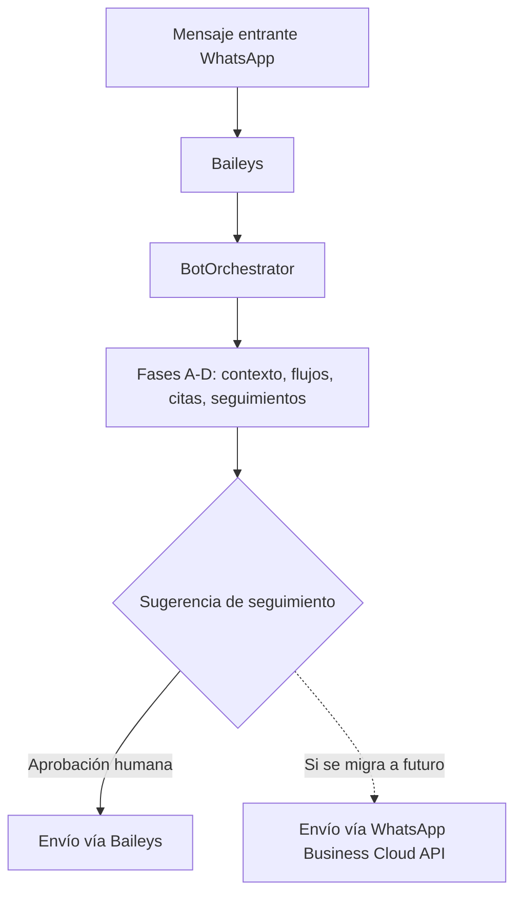

# ADR-001: Canal de WhatsApp — mantener Baileys vs migrar a WhatsApp Business Cloud API

> **ADR** = Architecture Decision Record

---

## Metadata

| Campo | Valor |
|-------|-------|
| **ID** | ADR-001 |
| **Estado** | [x] Propuesto &nbsp;&nbsp;[ ] Aceptado &nbsp;&nbsp;[ ] Deprecated &nbsp;&nbsp;[ ] Superseded |
| **Fecha** | 2026-09-18 |
| **Autor** | Claude Code (sesión de implementación de `docs/SPEC_CONVERSACION_GUIADA.md`) |
| **Revisores** | Pendiente — decisión del propietario del sistema |
| **Supersede** | — |

---

## Contexto

### Situación Actual
El bot usa **Baileys**, una librería no oficial que se conecta a WhatsApp emulando un cliente web (WhatsApp Web). Es la base de todo el sistema: `BotService`, `BotOrchestrator`, y ahora también las Fases A–D de `docs/SPEC_CONVERSACION_GUIADA.md` (contexto conversacional, flujos guiados, citas y re-engagement).

### Problema a Resolver
La Fase D introduce mensajes de seguimiento generados por el sistema (aunque siempre con aprobación humana antes de enviarse) y la Fase C crea citas a partir de conversaciones. Esto aumenta el volumen y la naturaleza "proactiva" de los mensajes salientes respecto al bot puramente reactivo de antes. Baileys no es una API oficial: Meta puede banear números que detecte con patrones de uso "automatizado" o "comercial masivo", y no hay SLA ni soporte oficial. Hay que decidir si el uso actual y el crecimiento esperado (más actividades hoteleras, más seguimientos) justifican migrar a la **WhatsApp Business Cloud API** (oficial, vía Meta).

### Restricciones
- El operador del sistema depende de la música/eventos en hoteles como ingreso principal; una cuenta baneada interrumpe la operación del negocio, no solo del software.
- La API oficial de Meta tiene costo por conversación (fuera de la ventana de 24h se cobra, y algunas categorías de mensaje requieren plantillas pre-aprobadas).
- No hay equipo de desarrollo dedicado full-time; el mantenimiento debe ser sostenible para una sola persona con conocimientos de programación pero cuya actividad principal no es el desarrollo de software.
- Verificación de negocio (Meta Business Manager) y aprobación de plantillas tienen tiempos de espera fuera de nuestro control.

### Stakeholders Afectados
| Stakeholder | Impacto |
|-------------|---------|
| Operador del sistema (dueño del número de WhatsApp) | Riesgo de baneo (Baileys) vs costo recurrente y proceso de aprobación (API oficial) |
| Clientes/hoteles que reciben mensajes | Con API oficial, un mensaje de seguimiento fuera de la ventana de 24h debe ser una plantilla aprobada — cambia qué se les puede escribir y cuándo |
| Fase D (re-engagement) | Su capacidad de reabrir conversaciones frías depende directamente de esta decisión (ver sección "Consecuencias") |

---

## Decisión

### Resumen
> Por ahora, **mantener Baileys** y no migrar a la WhatsApp Business Cloud API; reevaluar cuando se cumpla alguno de los triggers de la sección "Criterios de reevaluación", en vez de migrar de forma preventiva.

### Descripción Detallada
El volumen actual (un bot asistiendo consultas de un músico/coordinador, más las citas y seguimientos que empiezan a introducir las Fases C y D) no justifica todavía el costo y la complejidad operativa de la API oficial: verificación de negocio, gestión de plantillas pre-aprobadas, facturación por conversación, y la pérdida de flexibilidad para responder con texto libre fuera de la ventana de 24h. La mitigación principal del riesgo de baneo es la que ya exige `AGENTS.md`/`CLAUDE.md`: rate limiting estricto (mínimo 2s entre mensajes) y, específicamente para Fase D, el límite de una sugerencia de seguimiento por chat por semana y la aprobación humana obligatoria antes de cualquier envío — ningún mensaje sale sin que una persona lo revise primero, lo que de por sí limita el volumen y evita el patrón de "envío masivo automatizado" que dispara baneos.

Esta decisión es explícitamente **reversible y temporal**: se documenta aquí para que, si el sistema crece, la migración no sea una sorpresa sino un paso ya evaluado.

### Diagrama

---

## Alternativas Consideradas

### Alternativa 1: Migrar ahora a WhatsApp Business Cloud API

**Descripción:**
Reemplazar `BotService`/Baileys por la API oficial de Meta (Graph API), con verificación de negocio y plantillas de mensaje aprobadas para reabrir conversaciones.

**Pros:**
- Sin riesgo de baneo por uso "no oficial"
- Soporte y SLA de Meta
- Mejor preparado para escalar a mayor volumen (múltiples números, equipos)

**Contras:**
- Costo recurrente por conversación fuera de la ventana de 24h — justo el caso de uso de Fase D (retomar conversaciones frías)
- Cualquier mensaje de seguimiento fuera de esa ventana debe ser una plantilla pre-aprobada por Meta, no el texto libre que hoy genera `TemplateMessageGenerator`/Gemini — requeriría rediseñar esa parte de Fase D
- Proceso de verificación de negocio y aprobación de plantillas con tiempos fuera de nuestro control
- Reescritura de `BotService` y de todo lo que depende de sus eventos (`BotOrchestrator`, Fases A–D)

**Razón de descarte:**
El costo de migración (tiempo + dinero + rediseño de Fase D) no está justificado por el volumen actual. Migrar ahora sería resolver un problema que todavía no existe, a costa de uno que sí existe (tiempo del operador).

---

### Alternativa 2: Mantener Baileys, sin cambios (elegida)

**Descripción:**
Seguir usando Baileys, reforzando las mitigaciones de rate limiting y aprobación humana ya presentes en Fases A–D.

**Pros:**
- Sin costo adicional, sin fricción para el operador
- Texto libre en cualquier momento (no depende de plantillas aprobadas) — necesario para el tono conversacional que persigue el spec completo
- No requiere reescribir nada de lo ya implementado

**Contras:**
- Riesgo de baneo persiste (mitigado, no eliminado)
- Sin soporte oficial si Meta cambia el protocolo que Baileys emula

**Razón de descarte:**
No se descartó — es la decisión.

---

### Alternativa 3: No hacer nada (evaluar la decisión más adelante sin documentarla)

**Descripción:**
No escribir este ADR y decidir "sobre la marcha" si algún día hay un baneo o el volumen crece.

**Pros:**
- Cero esfuerzo ahora

**Contras:**
- Un baneo real sería una sorpresa operativa (pérdida del número/negocio) en vez de un riesgo ya evaluado y monitoreado
- Fase D ya introduce mensajes proactivos; no evaluar el riesgo ahora es dejar una decisión importante sin registro

**Razón de descarte:**
El spec (sección 14) pide explícitamente este ADR antes de construir re-engagement a escala; ya se construyó la Fase D, así que corresponde dejarlo evaluado ahora, no después de un incidente.

---

## Análisis de Trade-offs

| Aspecto | Mantener Baileys (elegida) | Migrar a Cloud API |
|---------|------------------------------|---------------------|
| Complejidad | Baja (ya implementado) | Alta (rediseño de envío + plantillas) |
| Costo | $0 | Variable, por conversación fuera de ventana 24h |
| Tiempo impl. | 0 (ya está) | Días–semanas (verificación de negocio incluida) |
| Riesgo de baneo | Medio, mitigado por rate limiting + aprobación humana | Ninguno (canal oficial) |
| Flexibilidad de mensaje | Alta (texto libre siempre) | Baja fuera de la ventana de 24h (requiere plantillas) |
| Encaja con Fase D tal como está | Sí | No sin rediseño |

---

## Consecuencias

### Positivas
- Fase D (re-engagement) funciona tal como está implementada, sin rediseño
- Cero costo adicional mientras el volumen se mantenga bajo
- El operador no depende de un proceso de aprobación de Meta para operar día a día

### Negativas
- El riesgo de baneo no desaparece, solo se mitiga
- Si el volumen crece rápido (por ejemplo, si aumentan mucho las actividades hoteleras y con ellas las conversaciones), la migración eventualmente será necesaria y no es instantánea

### Riesgos
| Riesgo | Probabilidad | Impacto | Mitigación |
|--------|--------------|---------|------------|
| Baneo del número por patrón de uso | Baja–Media | Alto (interrumpe el negocio) | Rate limiting (≥2s entre mensajes), aprobación humana obligatoria en Fase D, límite de 1 seguimiento/chat/semana |
| Cambio en el protocolo que Baileys emula deja de funcionar | Baja | Alto | Monitorear el proyecto Baileys upstream; este ADR es el punto de partida para migrar si ocurre |
| Crecimiento de volumen que sí justifique la API oficial | Media (es el objetivo del negocio) | Medio | Ver "Criterios de reevaluación" abajo |

### Deuda Técnica Introducida
- [ ] Ninguna
- [x] Ninguna nueva; se documenta el riesgo ya existente desde antes de este ADR, sin agregarlo.

---

## Criterios de Reevaluación

Revisar esta decisión (no esperar a un incidente) cuando ocurra cualquiera de estos:
1. El volumen de conversaciones activas/día supera lo que una sola persona puede razonablemente supervisar (aprobar cada seguimiento de Fase D deja de ser viable).
2. Ocurre una advertencia o restricción temporal de WhatsApp sobre el número.
3. El negocio contrata o incorpora más personas que necesitan enviar desde el mismo sistema (multi-agente), lo cual la API oficial soporta mejor que Baileys.
4. Se evalúa monetizar el sistema para otros negocios/hoteles (multi-tenant), donde la falta de soporte oficial es un riesgo inaceptable para terceros.

---

## Implementación

No aplica — esta es una decisión de **no migrar por ahora**, sin plan de acción inmediato más allá de mantener las mitigaciones ya implementadas en Fases A–D.

---

## Validación

### Criterios de Éxito
- [ ] Cero baneos o restricciones del número en los próximos 6 meses de operación con Fases A–D activas
- [ ] El límite de 1 seguimiento/chat/semana (Fase D) resulta suficiente para no generar quejas de spam

### Métricas a Monitorear
| Métrica | Valor actual | Valor esperado |
|---------|--------------|-----------------|
| Mensajes salientes/día (incluye seguimientos aprobados) | Por establecer con `MetricsService` | Sin picos que disparen detección de spam |
| Sugerencias de seguimiento aprobadas vs descartadas (Fase D) | Por establecer | Referencia para dimensionar volumen real |

### Rollback Plan
No aplica (no hay migración que revertir). Si en el futuro se migra a la Cloud API y hay que volver atrás, ese rollback se documentaría en un ADR posterior.

---

## Referencias

- `docs/SPEC_CONVERSACION_GUIADA.md`, secciones 9 (integraciones a evaluar) y 14 (próximos pasos)
- `AGENTS.md` / `CLAUDE.md` — regla de rate limiting obligatorio para WhatsApp

---

## Historial de Estados

| Fecha | Estado | Autor | Notas |
|-------|--------|-------|-------|
| 2026-09-18 | Propuesto | Claude Code | Versión inicial — pendiente de aceptación por el propietario del sistema |

---

*ADR generado como parte de la Fase E de `docs/SPEC_CONVERSACION_GUIADA.md`.*
