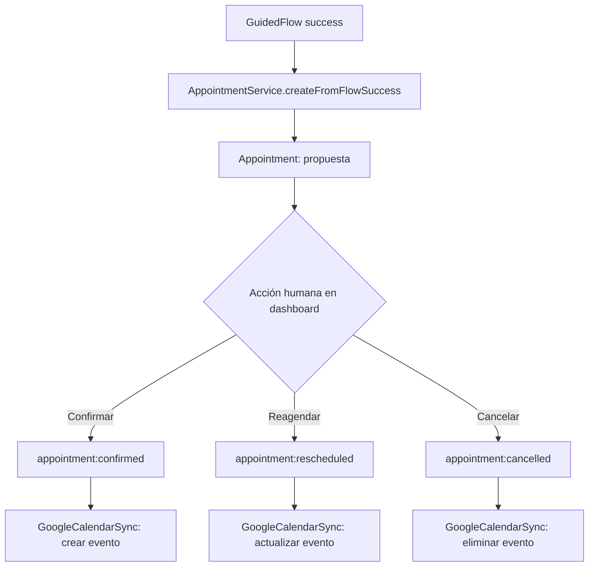

# ADR-002: Integración de calendario externo para la entidad Appointment

> **ADR** = Architecture Decision Record

---

## Metadata

| Campo | Valor |
|-------|-------|
| **ID** | ADR-002 |
| **Estado** | [ ] Propuesto &nbsp;&nbsp;[x] Aceptado &nbsp;&nbsp;[ ] Deprecated &nbsp;&nbsp;[ ] Superseded |
| **Fecha** | 2026-09-18 |
| **Autor** | Claude Code (sesión de implementación de `docs/SPEC_CONVERSACION_GUIADA.md`) |
| **Revisores** | Propietario del sistema — confirmó el 2026-09-18 que usa Google Calendar activamente |
| **Supersede** | — |
| **Relacionado** | ADR-001 (canal de WhatsApp) |

---

## Contexto

### Situación Actual
La Fase C implementó la entidad `Appointment` (`src/modules/appointments/`): cuando un flujo guiado (Fase B) captura `tipoEvento` y `fecha`, se crea una cita en estado `propuesta`, visible en el dashboard (`/appointments`), donde un humano la confirma, cancela o reagenda. Hoy esa cita vive **únicamente** en `data/appointments.json` — no aparece en ningún calendario externo.

### Problema a Resolver
El operador coordina actividades musicales en hoteles y, además, tiene responsabilidades administrativas (coordinador del programa orquestal). **Confirmó que usa Google Calendar activamente** para su agenda. Sin integración, cada cita confirmada en el dashboard del bot exige un paso manual adicional (copiarla a Google Calendar) para que aparezca junto al resto de sus compromisos — justo el tipo de fricción que el spec busca reducir (sección 0: ayudar a convertir conversaciones en citas de forma eficiente).

### Restricciones
- Requiere credenciales OAuth de Google (Service Account o OAuth de usuario) — nunca hardcodeadas, vía variables de entorno (regla de `CLAUDE.md`).
- El proyecto hoy no tiene sistema de autenticación de usuarios del dashboard (`CLAUDE.md`: "NO tiene aún: Sistema de autenticación"), así que las credenciales de Google Calendar son a nivel de sistema/operador, no por usuario del dashboard.
- Una cita de WhatsApp sigue naciendo como *propuesta*, nunca confirmada automáticamente (regla de Fase C) — la integración no debe cambiar eso: **solo se crea el evento en Google Calendar cuando la cita pasa a `confirmada`**, nunca antes.
- Alcance inicial uni-direccional (bot → Google Calendar); sincronización de vuelta queda fuera por ahora (ver "Alternativas Consideradas").

### Stakeholders Afectados
| Stakeholder | Impacto |
|-------------|---------|
| Operador del sistema | Gana visibilidad unificada de su agenda sin pasos manuales, a cambio de configurar credenciales de Google una vez |
| Clientes/hoteles con citas propuestas | Ninguno directo — la integración es solo de visibilidad para el operador |

---

## Decisión

### Resumen
> Integrar Google Calendar de forma **uni-direccional** (bot → calendario): al confirmar, cancelar o reagendar una cita en el dashboard, sincronizar automáticamente el evento correspondiente en Google Calendar, sin sincronización de vuelta en esta fase.

### Descripción Detallada
`AppointmentService` (Fase C) ya emite los eventos `appointment:confirmed`, `appointment:cancelled` y `appointment:rescheduled` a través de su `EventEmitter`. La integración se implementa como un **adaptador nuevo** que escucha esos eventos y llama a la API de Google Calendar — sin tocar `domain/Appointment.ts` ni la lógica de negocio existente, siguiendo el mismo patrón hexagonal usado en Fases A–D (dominio y aplicación no saben que Google Calendar existe; es un detalle de infraestructura).

Flujo:
- `appointment:confirmed` → crear evento en Google Calendar con `contactName`, `type`, `proposedDate` y un enlace de vuelta al chat de WhatsApp en la descripción.
- `appointment:rescheduled` → actualizar la fecha del evento existente.
- `appointment:cancelled` → eliminar (o marcar cancelado) el evento.
- Ninguna otra transición de `Appointment` toca Google Calendar — en particular, **nunca** se crea un evento para una cita en estado `propuesta`, para no ensuciar el calendario del operador con citas que un cliente aún no confirmó.

Se guarda el `googleEventId` devuelto por la API junto al `Appointment` (campo nuevo, opcional) para poder actualizar/eliminar el evento correcto en los pasos siguientes.

### Diagrama


---

## Alternativas Consideradas

### Alternativa 1: Integración uni-direccional (bot → calendario) — elegida

**Descripción:**
Al confirmar/reagendar/cancelar una cita en el dashboard, reflejar el cambio en Google Calendar. Sin escuchar cambios que el operador haga directamente en Google Calendar.

**Pros:**
- Cubre el caso de uso real confirmado por el operador (ver su agenda unificada)
- Relativamente simple: un solo sentido, disparado por eventos que `AppointmentService` ya emite
- No requiere webhooks de Google ni manejo de conflictos de sincronización

**Contras:**
- Si el operador mueve o borra el evento directamente en Google Calendar, el dashboard no se entera — puede quedar desincronizado
- Requiere manejo de fallos: si la llamada a Google Calendar falla (token expirado, sin conexión), la cita en el dashboard debe seguir siendo la fuente de verdad y no bloquear la confirmación

**Razón de descarte:**
No se descartó — es la decisión. El riesgo de desincronización se acepta porque el dashboard sigue siendo la fuente de verdad para el estado de la cita; Google Calendar es una vista adicional, no un segundo sistema de registro.

---

### Alternativa 2: Integración bidireccional completa

**Descripción:**
Sincronización en ambos sentidos, con webhooks de Google Calendar para detectar cambios externos y reflejarlos en `Appointment`.

**Pros:**
- El operador podría editar desde cualquiera de los dos lados sin perder consistencia

**Contras:**
- Complejidad significativamente mayor: webhooks, resolución de conflictos, reintentos, validación de qué cambios son válidos de vuelta (¿puede alguien cambiar el estado de una cita a `confirmada` solo por moverla en Calendar?)
- Ningún caso de uso actual la requiere todavía

**Razón de descarte:**
Desproporcionado frente al problema real (visibilidad, no edición bidireccional). Se puede reconsiderar como ADR posterior si la Alternativa 1 resulta insuficiente en la práctica.

---

### Alternativa 3: No integrar

**Descripción:**
Mantener `Appointment` solo en el dashboard, como quedó en Fase C.

**Pros:**
- Cero complejidad y cero dependencias nuevas

**Contras:**
- El operador confirmó que sí usa Google Calendar activamente — mantener esto obliga a un paso manual repetido

**Razón de descarte:**
Era la decisión anterior de este mismo ADR (ver Historial de Estados), tomada porque no estaba confirmado el uso real de Google Calendar. Ya se confirmó, así que deja de aplicar.

---

## Análisis de Trade-offs

| Aspecto | Uni-direccional (elegida) | Bidireccional | No integrar |
|---------|----------------------------|----------------|---------------|
| Complejidad | Media | Alta | Ninguna |
| Costo | $0 (cuota gratuita de Google suele bastar) | $0, pero más superficie de fallo | $0 |
| Tiempo impl. | ~1-2 días | ~1 semana+ | 0 |
| Dependencia externa nueva | Sí (OAuth Google) | Sí (OAuth + webhooks) | No |
| Resuelve el problema confirmado | Sí | Sí (sobre-resuelto) | No |

---

## Consecuencias

### Positivas
- El operador ve sus citas confirmadas en Google Calendar sin pasos manuales
- Cambio aislado en infraestructura (`src/modules/appointments/infrastructure/`), sin tocar dominio ni aplicación ya probados en Fase C
- `googleEventId` guardado junto al `Appointment` permite actualizar/eliminar correctamente sin duplicar eventos

### Negativas
- Nueva dependencia externa (Google Calendar API) con su propia superficie de fallo (cuota, token expirado, conectividad)
- Posible desincronización si el operador edita directamente en Google Calendar (aceptado, ver Alternativa 1)

### Riesgos
| Riesgo | Probabilidad | Impacto | Mitigación |
|--------|--------------|---------|------------|
| Fallo al llamar a la API de Google Calendar (token expirado, cuota, red) | Media | Bajo | La confirmación de la cita en el dashboard **nunca** depende de que la sincronización tenga éxito; el fallo se loguea y no bloquea el flujo humano |
| Token OAuth expira sin renovación automática | Media | Medio | Usar refresh token de larga duración (Service Account u OAuth con `access_type=offline`); alertar en logs si falla la renovación |
| Evento duplicado por reintentos | Baja | Bajo | Guardar y reutilizar `googleEventId`; solo crear si no existe |

### Deuda Técnica Introducida
- [ ] Ninguna
- [x] Riesgo de desincronización si el operador edita directamente en Google Calendar (documentado y aceptado, ver Alternativa 1); se revisita si en la práctica genera confusión.

---

## Implementación

### Plan de Acción
1. Habilitar Google Calendar API en un proyecto de Google Cloud y generar credenciales (Service Account recomendado para evitar re-autenticación manual periódica). **Pendiente — tarea del operador, no de código.**
2. Guardar el JSON de la Service Account en `secrets/google-calendar-sa.json` (ruta ignorada por git, ver `.gitignore`) y compartir el calendario correspondiente con el email de esa cuenta de servicio. **Pendiente — tarea del operador.**
3. ~~Extender `domain/Appointment.ts` con un campo opcional `googleEventId?: string`~~ — hecho.
4. ~~Crear `src/modules/appointments/infrastructure/GoogleCalendarSync.ts`~~ — hecho: escucha `appointment:confirmed`/`rescheduled`/`cancelled` en `AppointmentService` y llama a la Calendar API vía `googleapis`.
5. ~~Wirear el listener en `src/server/index.ts`~~ — hecho, vía `initGoogleCalendarSync()` (no-op si `GOOGLE_CALENDAR_ENABLED` no es `true`).
6. ~~Manejar errores sin bloquear el flujo del dashboard~~ — hecho: toda llamada a la API es best-effort, solo logging (`GoogleCalendarSync` nunca lanza hacia `AppointmentService`).

Para activar: copiar `.env.example`, poner `GOOGLE_CALENDAR_ENABLED=true`, completar `GOOGLE_CALENDAR_CREDENTIALS_PATH` y `GOOGLE_CALENDAR_ID`, y reiniciar el servidor.

### Estimación
| Fase | Tiempo estimado |
|------|-----------------|
| Configuración de credenciales Google | 1-2 horas (depende de si ya existe un proyecto de Google Cloud) |
| Implementación del adaptador | 3-4 horas |
| Testing manual end-to-end | 1-2 horas |

### Dependencias
- Librería oficial `googleapis` (Node.js) para la Calendar API
- Credenciales de Google Cloud (Service Account con acceso al calendario del operador, compartido explícitamente con esa cuenta de servicio)

### Feature Flags
```
GOOGLE_CALENDAR_ENABLED=true
GOOGLE_CALENDAR_CREDENTIALS_PATH=./secrets/google-calendar-sa.json
GOOGLE_CALENDAR_ID=primary
```
Si `GOOGLE_CALENDAR_ENABLED` no está en `true`, el listener no se registra — el sistema sigue funcionando exactamente igual que hoy (sin sincronización), para no bloquear el resto del sistema si las credenciales aún no están configuradas.

---

## Validación

### Criterios de Éxito
- [ ] Confirmar una cita en `/appointments` crea el evento correspondiente en el Google Calendar del operador en menos de unos segundos
- [ ] Cancelar/reagendar una cita ya sincronizada actualiza o elimina el evento correctamente, sin duplicados
- [ ] Un fallo de la API de Google Calendar no impide confirmar/cancelar/reagendar la cita en el dashboard

### Métricas a Monitorear
| Métrica | Valor actual | Valor esperado |
|---------|--------------|-----------------|
| Citas confirmadas con `googleEventId` guardado | 0 (no implementado) | 100% de las confirmadas después del despliegue |
| Errores de sincronización logueados | N/A | Cercano a 0 en operación normal |

### Rollback Plan
1. Poner `GOOGLE_CALENDAR_ENABLED=false` — el sistema vuelve a comportarse exactamente como antes de este ADR, sin tocar `Appointment` ni el dashboard.
2. Si hace falta revertir el código, el cambio está aislado a `infrastructure/GoogleCalendarSync.ts` y al campo opcional `googleEventId`, sin dependencias cruzadas.

---

## Referencias

- `docs/SPEC_CONVERSACION_GUIADA.md`, sección 9 (integraciones a evaluar) y sección 6 (entidad Appointment)
- `src/modules/appointments/application/AppointmentService.ts` — eventos usados como punto de extensión
- [Google Calendar API — Node.js quickstart](https://developers.google.com/calendar/api/quickstart/nodejs)

---

## Historial de Estados

| Fecha | Estado | Autor | Notas |
|-------|--------|-------|-------|
| 2026-09-18 | Propuesto | Claude Code | Versión inicial — pendiente de confirmar con el operador si usa Google Calendar |
| 2026-09-18 | Aceptado | Claude Code (a pedido del operador) | Operador confirmó uso activo de Google Calendar; se cambia la decisión a integrar de forma uni-direccional |
| 2026-09-18 | Aceptado (implementado, pendiente de credenciales) | Claude Code | `GoogleCalendarSync.ts` implementado y wireado en `src/server/index.ts`, `googleEventId` agregado a `Appointment`. Sigue sin efecto mientras `GOOGLE_CALENDAR_ENABLED` no esté en `true` y no exista un Service Account real en `GOOGLE_CALENDAR_CREDENTIALS_PATH` — los criterios de éxito de esta sección quedan pendientes de validar con credenciales reales, no de código |

---

*ADR generado como parte de la Fase E de `docs/SPEC_CONVERSACION_GUIADA.md`.*
