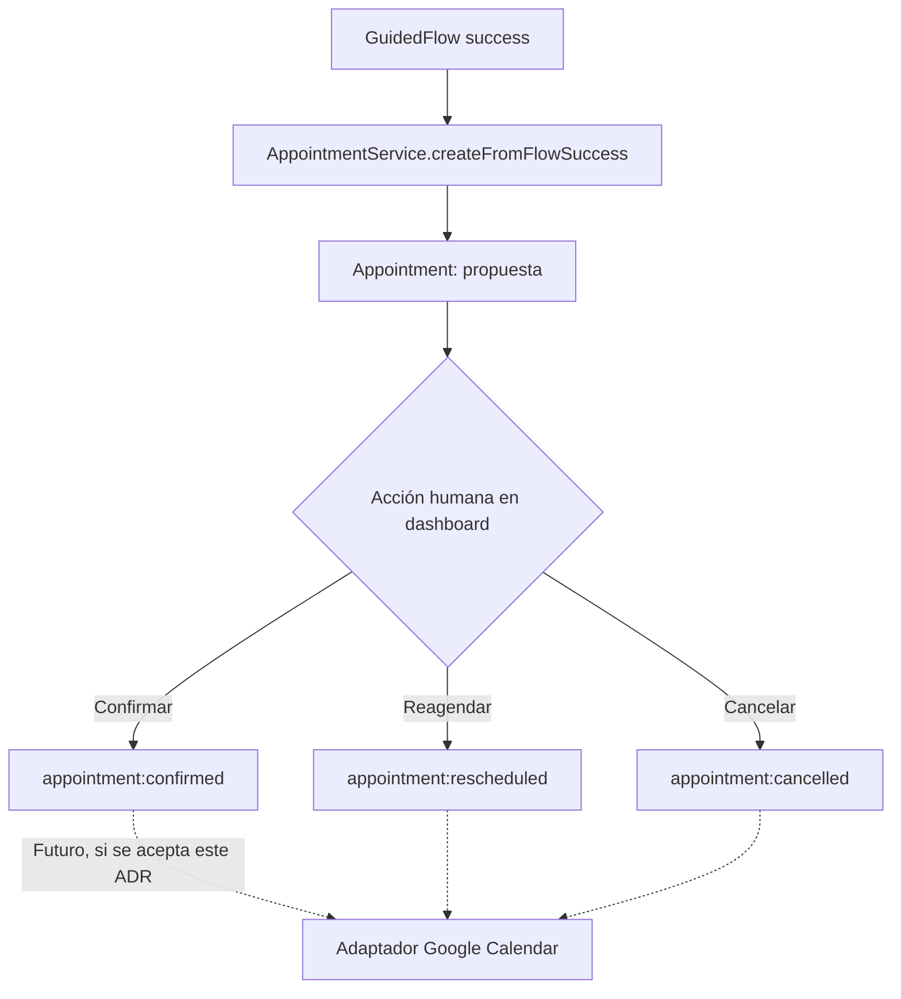

# ADR-002: Integración de calendario externo para la entidad Appointment

> **ADR** = Architecture Decision Record

---

## Metadata

| Campo | Valor |
|-------|-------|
| **ID** | ADR-002 |
| **Estado** | [x] Propuesto &nbsp;&nbsp;[ ] Aceptado &nbsp;&nbsp;[ ] Deprecated &nbsp;&nbsp;[ ] Superseded |
| **Fecha** | 2026-09-18 |
| **Autor** | Claude Code (sesión de implementación de `docs/SPEC_CONVERSACION_GUIADA.md`) |
| **Revisores** | Pendiente — decisión del propietario del sistema |
| **Supersede** | — |
| **Relacionado** | ADR-001 (canal de WhatsApp) |

---

## Contexto

### Situación Actual
La Fase C implementó la entidad `Appointment` (`src/modules/appointments/`): cuando un flujo guiado (Fase B) captura `tipoEvento` y `fecha`, se crea una cita en estado `propuesta`, visible en el dashboard (`/appointments`), donde un humano la confirma, cancela o reagenda. Hoy esa cita vive **únicamente** en `data/appointments.json` — no aparece en ningún calendario externo.

### Problema a Resolver
El operador coordina actividades musicales en hoteles y, además, tiene responsabilidades administrativas (coordinador del programa orquestal). Es razonable que quiera ver sus citas propuestas/confirmadas junto con el resto de su agenda (ensayos, clases, otros compromisos), no solo dentro del dashboard del bot. Hay que decidir si vale la pena integrar un calendario externo (Google Calendar es el candidato natural, per spec sección 9) y, si es así, con qué alcance.

### Restricciones
- El operador ya podría estar usando Google Calendar u otro calendario para su actividad musical/institucional — no lo sabemos con certeza, hay que confirmarlo antes de implementar.
- Cualquier integración de calendario añade una dependencia externa (credenciales OAuth, cuota de API) al proyecto, que hoy no tiene autenticación de usuarios del propio dashboard (ver `CLAUDE.md`: "NO tiene aún: Sistema de autenticación").
- Una cita de WhatsApp sigue naciendo como *propuesta*, nunca confirmada automáticamente (regla de Fase C) — la integración de calendario no debe cambiar eso.

### Stakeholders Afectados
| Stakeholder | Impacto |
|-------------|---------|
| Operador del sistema | Ganaría visibilidad unificada de su agenda, a cambio de configurar una integración |
| Clientes/hoteles con citas propuestas | Ninguno directo — la integración es solo de visibilidad para el operador |

---

## Decisión

### Resumen
> **No integrar todavía** un calendario externo; mantener `Appointment` solo en el dashboard del bot, y diseñar el modelo de datos (ya hecho en Fase C) de forma que una integración futura sea un adaptador nuevo, no un rediseño.

### Descripción Detallada
Faltan dos datos que deberían confirmarse con el operador antes de construir esto: (1) si realmente usa Google Calendar activamente para su agenda musical/institucional (spec sección 9 lo deja como pregunta abierta), y (2) qué pasaría con la sincronización bidireccional — si una cita se mueve en Google Calendar, ¿debe reflejarse en el dashboard? Implementar la integración sin esas respuestas arriesga construir algo que no se usa o que sincroniza mal.

La arquitectura ya deja la puerta abierta sin costo: `AppointmentService` (Fase C) es la única fuente de verdad de cambios de estado (`confirm`/`cancel`/`reschedule`), así que agregar una integración de calendario más adelante es tan simple como escuchar sus eventos (`appointment:confirmed`, `appointment:cancelled`, `appointment:rescheduled`, ya emitidos por el `EventEmitter` del servicio) y llamar a la API de Google Calendar desde un nuevo listener/adaptador — sin tocar el dominio de `Appointment` ni el dashboard existente.

### Diagrama

---

## Alternativas Consideradas

### Alternativa 1: Integrar Google Calendar ahora (uni-direccional: bot → calendario)

**Descripción:**
Al confirmar una cita en el dashboard, crear automáticamente un evento en Google Calendar (sin sincronización de vuelta).

**Pros:**
- Visibilidad inmediata de citas confirmadas junto al resto de la agenda del operador
- Relativamente simple: un solo sentido de sincronización, disparado por `appointment:confirmed`

**Contras:**
- Requiere OAuth de Google y manejo de tokens — nueva superficie de configuración y de posibles fallos silenciosos (¿qué pasa si el token expira?)
- No confirmado que el operador use Google Calendar como su calendario principal
- Si luego el operador mueve/cancela el evento directamente en Google Calendar, el dashboard no se entera (no hay sincronización de vuelta) — puede generar inconsistencias

**Razón de descarte:**
Falta la confirmación de que este es el calendario correcto y el flujo de uso real; construirlo ahora es especulativo.

---

### Alternativa 2: Integración bidireccional completa

**Descripción:**
Sincronización en ambos sentidos entre `Appointment` y Google Calendar, con webhooks de Google para detectar cambios externos.

**Pros:**
- Fuente única de verdad percibida por el operador (puede editar desde cualquier lado)

**Contras:**
- Complejidad significativamente mayor (manejo de conflictos, webhooks, reintentos)
- Ningún caso de uso actual la requiere — es sobre-ingeniería en este momento

**Razón de descarte:**
Desproporcionado para el problema actual; ni siquiera la integración simple (Alternativa 1) está confirmada como necesaria todavía.

---

### Alternativa 3: No integrar (elegida)

**Descripción:**
Mantener `Appointment` solo en el dashboard, tal como quedó en Fase C.

**Pros:**
- Cero complejidad y cero dependencias nuevas
- El modelo de datos y los eventos de `AppointmentService` ya permiten agregar un adaptador después sin rediseño

**Contras:**
- El operador debe revisar el dashboard del bot y su calendario personal por separado, mientras no se integre

**Razón de descarte:**
No se descartó — es la decisión, hasta confirmar la necesidad real con el operador.

---

## Análisis de Trade-offs

| Aspecto | No integrar (elegida) | Google Calendar uni-direccional | Bidireccional |
|---------|------------------------|----------------------------------|----------------|
| Complejidad | Ninguna | Media | Alta |
| Costo | $0 | $0 (cuota gratuita de Google suele bastar) | $0, pero más superficie de fallo |
| Tiempo impl. | 0 | ~1-2 días | ~1 semana+ |
| Dependencia externa nueva | No | Sí (OAuth Google) | Sí (OAuth + webhooks) |
| Riesgo de inconsistencia | Ninguno | Medio (solo un sentido) | Bajo si está bien implementado, pero más piezas que pueden fallar |

---

## Consecuencias

### Positivas
- Cero esfuerzo y cero riesgo adicional ahora
- Camino claro para agregarlo después, sin deuda técnica: los eventos de `AppointmentService` ya existen

### Negativas
- El operador sigue teniendo que mirar dos lugares (dashboard + su calendario) hasta que esto se resuelva

### Riesgos
| Riesgo | Probabilidad | Impacto | Mitigación |
|--------|--------------|---------|------------|
| El operador de hecho sí necesita esto y no se implementa a tiempo | Media | Bajo–Medio (incomodidad, no pérdida de datos) | Confirmar con el operador en el próximo ciclo de feedback; el ADR queda listo para aprobarse rápido |

### Deuda Técnica Introducida
- [x] Ninguna

---

## Implementación

No aplica todavía. Si se acepta integrar más adelante (Alternativa 1):
1. Confirmar con el operador que Google Calendar es el calendario a usar.
2. Crear un adaptador `infrastructure/GoogleCalendarSync.ts` en `src/modules/appointments/` que escuche `appointment:confirmed`/`appointment:rescheduled`/`appointment:cancelled` desde `AppointmentService` y llame a la API de Google Calendar.
3. Manejar credenciales OAuth vía variables de entorno, nunca hardcodeadas (regla de `CLAUDE.md`).
4. No tocar `domain/Appointment.ts` ni `application/AppointmentService.ts` — el punto de extensión son los eventos ya emitidos.

---

## Validación

### Criterios de Éxito
- [ ] Confirmación explícita del operador sobre si usa o no Google Calendar activamente, antes de implementar cualquier alternativa distinta a "no integrar"

### Métricas a Monitorear
No aplica mientras no se implemente.

### Rollback Plan
No aplica.

---

## Referencias

- `docs/SPEC_CONVERSACION_GUIADA.md`, sección 9 (integraciones a evaluar) y sección 6 (entidad Appointment)
- `src/modules/appointments/application/AppointmentService.ts` — eventos ya disponibles como punto de extensión

---

## Historial de Estados

| Fecha | Estado | Autor | Notas |
|-------|--------|-------|-------|
| 2026-09-18 | Propuesto | Claude Code | Versión inicial — pendiente de confirmar con el operador si usa Google Calendar |

---

*ADR generado como parte de la Fase E de `docs/SPEC_CONVERSACION_GUIADA.md`.*
