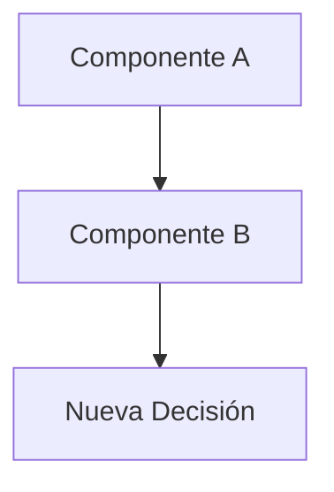

# ADR-[NNN]: [Título de la Decisión]

> **ADR** = Architecture Decision Record  
> Documento para registrar decisiones arquitectónicas importantes.

---

## Metadata

| Campo | Valor |
|-------|-------|
| **ID** | ADR-[NNN] |
| **Estado** | [ ] Propuesto | [ ] Aceptado | [ ] Deprecated | [ ] Superseded |
| **Fecha** | [YYYY-MM-DD] |
| **Autor** | [Nombre] |
| **Revisores** | [Nombres] |
| **Supersede** | [ADR-XXX si reemplaza otro] |

---

## Contexto

### Situación Actual
[Descripción del estado actual del sistema y por qué se necesita tomar una decisión]

### Problema a Resolver
[Descripción clara del problema o necesidad que motiva esta decisión]

### Restricciones
- [Restricción técnica 1]
- [Restricción de negocio 1]
- [Restricción de tiempo/recursos]

### Stakeholders Afectados
| Stakeholder | Impacto |
|-------------|---------|
| [Equipo/Persona] | [Cómo les afecta] |

---

## Decisión

### Resumen
> [Una oración que resume la decisión tomada]

### Descripción Detallada
[Explicación completa de qué se decidió hacer y cómo]

### Diagrama (si aplica)


---

## Alternativas Consideradas

### Alternativa 1: [Nombre]

**Descripción:**
[Qué implicaba esta alternativa]

**Pros:**
- [Ventaja 1]
- [Ventaja 2]

**Contras:**
- [Desventaja 1]
- [Desventaja 2]

**Razón de descarte:**
[Por qué no se eligió]

---

### Alternativa 2: [Nombre]

**Descripción:**
[Qué implicaba esta alternativa]

**Pros:**
- [Ventaja 1]

**Contras:**
- [Desventaja 1]

**Razón de descarte:**
[Por qué no se eligió]

---

### Alternativa 3: No hacer nada

**Descripción:**
Mantener el estado actual sin cambios.

**Pros:**
- Sin esfuerzo de implementación
- Sin riesgo de regresiones

**Contras:**
- [Problema que persiste]
- [Deuda técnica que se acumula]

**Razón de descarte:**
[Por qué no es viable]

---

## Análisis de Trade-offs

| Aspecto | Decisión elegida | Alternativa 1 | Alternativa 2 |
|---------|------------------|---------------|---------------|
| Complejidad | Media | Alta | Baja |
| Costo | $0 | $50/mes | $0 |
| Tiempo impl. | 2 días | 1 semana | 1 día |
| Escalabilidad | Alta | Alta | Baja |
| Mantenibilidad | Alta | Media | Alta |

---

## Consecuencias

### Positivas
- [Beneficio 1]
- [Beneficio 2]
- [Beneficio 3]

### Negativas
- [Costo/desventaja 1]
- [Costo/desventaja 2]

### Riesgos
| Riesgo | Probabilidad | Impacto | Mitigación |
|--------|--------------|---------|------------|
| [Riesgo 1] | Media | Alto | [Cómo mitigar] |
| [Riesgo 2] | Baja | Medio | [Cómo mitigar] |

### Deuda Técnica Introducida
- [ ] Ninguna
- [ ] [Descripción de deuda técnica y plan para pagarla]

---

## Implementación

### Plan de Acción
1. [Paso 1]
2. [Paso 2]
3. [Paso 3]

### Estimación
| Fase | Tiempo estimado |
|------|-----------------|
| Diseño | X horas |
| Implementación | X horas |
| Testing | X horas |
| Documentación | X horas |

### Dependencias
- [Dependencia 1]
- [Dependencia 2]

### Feature Flags (si aplica)
```
FEATURE_NEW_IMPLEMENTATION=true
```

---

## Validación

### Criterios de Éxito
- [ ] [Criterio medible 1]
- [ ] [Criterio medible 2]
- [ ] [Criterio medible 3]

### Métricas a Monitorear
| Métrica | Valor actual | Valor esperado |
|---------|--------------|----------------|
| [Métrica 1] | X | Y |

### Rollback Plan
En caso de problemas:
1. [Paso de rollback 1]
2. [Paso de rollback 2]

---

## Referencias

- [Link a documentación relacionada]
- [Link a issue/ticket]
- [Link a discusión]
- [Link a ADR relacionado]

---

## Historial de Estados

| Fecha | Estado | Autor | Notas |
|-------|--------|-------|-------|
| [YYYY-MM-DD] | Propuesto | [Nombre] | Versión inicial |
| [YYYY-MM-DD] | Aceptado | [Nombre] | Aprobado en reunión X |

---

## Comentarios de Revisión

### Revisor: [Nombre]
**Fecha:** [YYYY-MM-DD]

[Comentarios y feedback]

---

*Template ADR v1.0 — Proyecto WhatsApp Bot Platform*
