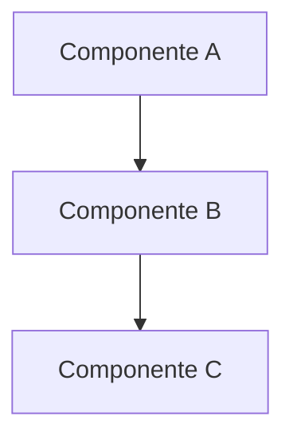

# 📄 Documentation Template

> Template para crear documentación técnica consistente.

---

## [Título del Componente/Feature]

### Metadata

| Campo | Valor |
|-------|-------|
| **Versión** | 1.0 |
| **Última actualización** | [YYYY-MM-DD] |
| **Autor** | [Nombre] |
| **Estado** | [ ] Borrador | [ ] Revisado | [ ] Publicado |

---

## 📋 Descripción General

### ¿Qué es?
[Descripción breve de 2-3 oraciones sobre qué es este componente/feature]

### ¿Para qué sirve?
[Propósito principal y casos de uso]

### ¿Quién lo usa?
- **Usuarios finales:** [si aplica]
- **Desarrolladores:** [cómo interactúan]
- **Administradores:** [si aplica]

---

## 🏗️ Arquitectura

### Diagrama


### Componentes principales

| Componente | Archivo | Responsabilidad |
|------------|---------|-----------------|
| [Nombre] | `src/path/file.ts` | [Qué hace] |

### Dependencias
- **Internas:** [otros componentes del proyecto]
- **Externas:** [librerías de terceros]

---

## 🚀 Instalación / Setup

### Prerrequisitos
- Node.js 20+
- [Otras dependencias]

### Pasos
```bash
# Paso 1: [Descripción]
comando

# Paso 2: [Descripción]
comando
```

### Configuración
```env
# Variables de entorno necesarias
VARIABLE_NAME=valor
```

---

## 📖 Uso

### Uso básico
```typescript
import { Component } from './path';

const instance = new Component();
const result = await instance.method();
```

### Ejemplos

#### Ejemplo 1: [Caso de uso común]
```typescript
// Código de ejemplo
```

**Resultado:**
```json
{
  "expected": "output"
}
```

#### Ejemplo 2: [Otro caso de uso]
```typescript
// Código de ejemplo
```

---

## 🔌 API Reference

### Métodos públicos

#### `methodName(params): ReturnType`

**Descripción:** [Qué hace el método]

**Parámetros:**
| Nombre | Tipo | Requerido | Default | Descripción |
|--------|------|-----------|---------|-------------|
| param1 | string | Sí | - | [Descripción] |
| param2 | number | No | 10 | [Descripción] |

**Retorna:**
```typescript
interface ReturnType {
  success: boolean;
  data?: any;
  error?: string;
}
```

**Ejemplo:**
```typescript
const result = await service.methodName('value', 20);
// { success: true, data: { ... } }
```

**Errores posibles:**
| Error | Causa | Solución |
|-------|-------|----------|
| `InvalidInput` | Parámetro inválido | Validar input |

---

### Endpoints (si aplica)

#### `GET /api/resource`

**Descripción:** Obtiene lista de recursos.

**Headers:**
| Header | Valor | Requerido |
|--------|-------|-----------|
| Content-Type | application/json | Sí |
| Authorization | Bearer {token} | No |

**Query Parameters:**
| Parámetro | Tipo | Default | Descripción |
|-----------|------|---------|-------------|
| limit | number | 20 | Máximo resultados |
| offset | number | 0 | Paginación |

**Response 200:**
```json
{
  "success": true,
  "data": [],
  "pagination": {
    "total": 100,
    "limit": 20,
    "offset": 0
  }
}
```

**Response 400:**
```json
{
  "success": false,
  "error": "Mensaje de error"
}
```

**cURL:**
```bash
curl -X GET "http://localhost:3000/api/resource?limit=10" \
  -H "Content-Type: application/json"
```

---

### Eventos (si aplica)

| Evento | Payload | Descripción |
|--------|---------|-------------|
| `resource:created` | `{ id, name }` | Emitido al crear |
| `resource:updated` | `{ id, changes }` | Emitido al actualizar |

**Suscripción:**
```typescript
service.on('resource:created', (data) => {
  console.log('Nuevo recurso:', data.id);
});
```

---

## ⚙️ Configuración

### Opciones disponibles

| Opción | Tipo | Default | Descripción |
|--------|------|---------|-------------|
| `option1` | boolean | true | [Descripción] |
| `option2` | number | 1000 | [Descripción] |

### Archivo de configuración
```json
// config/feature.json
{
  "option1": true,
  "option2": 1000
}
```

---

## 🔒 Seguridad

### Consideraciones
- [Punto de seguridad 1]
- [Punto de seguridad 2]

### Permisos requeridos
| Acción | Permiso necesario |
|--------|-------------------|
| Leer | `read:resource` |
| Crear | `write:resource` |

---

## 🐛 Troubleshooting

### Problema: [Descripción del problema]

**Síntomas:**
- [Síntoma 1]
- [Síntoma 2]

**Causa:**
[Explicación de la causa]

**Solución:**
```bash
# Pasos para resolver
comando
```

---

### Problema: [Otro problema común]

**Síntomas:**
- [Síntoma]

**Solución:**
[Pasos]

---

## 📊 Métricas / Monitoreo

### Logs
```
[INFO] [Component] Mensaje informativo
[ERROR] [Component] Mensaje de error
```

### Métricas clave
| Métrica | Descripción | Umbral alerta |
|---------|-------------|---------------|
| `component_requests` | Requests por minuto | >100/min |
| `component_errors` | Errores por minuto | >5/min |

---

## 📚 Referencias

- [Link a documentación relacionada](./related.md)
- [Link a arquitectura](../TECHNICAL_DOCUMENTATION.md)
- [Link externo](https://example.com)

---

## 📝 Changelog

| Versión | Fecha | Cambios |
|---------|-------|---------|
| 1.0 | YYYY-MM-DD | Versión inicial |

---

*Documentación generada para el proyecto WhatsApp Bot Platform*
