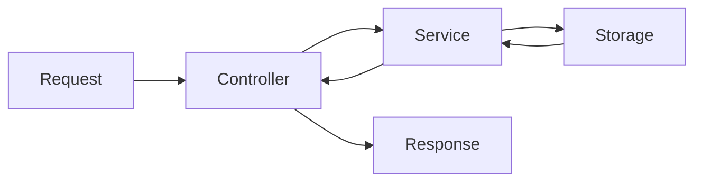

# 🧪 Test Plan Template

> Template para crear planes de prueba estructurados.

---

## Información General

| Campo | Valor |
|-------|-------|
| **Feature/Componente** | [Nombre] |
| **Versión** | [v1.0] |
| **Autor** | [Nombre] |
| **Fecha** | [YYYY-MM-DD] |
| **Estado** | [ ] Borrador | [ ] En revisión | [ ] Aprobado |

---

## 1. Alcance

### En Scope
- [Funcionalidad 1 a probar]
- [Funcionalidad 2 a probar]
- [Integración con X]

### Fuera de Scope
- [Qué NO se probará]
- [Motivo]

### Dependencias
- [Servicio/componente del que depende]
- [Datos de prueba necesarios]

---

## 2. Estrategia de Testing

### Niveles de Prueba

| Nivel | Herramienta | Cobertura objetivo |
|-------|-------------|-------------------|
| Unitarias | Jest | 80% |
| Integración | Jest + Supertest | Flujos críticos |
| E2E | Manual / Playwright | Happy paths |

### Ambientes

| Ambiente | URL/Config | Propósito |
|----------|------------|-----------|
| Local | localhost:3000 | Desarrollo |
| CI | GitHub Actions | Automatizado |
| Staging | [URL] | QA manual |

---

## 3. Casos de Prueba

### 3.1 Pruebas Unitarias

#### CP-U001: [Nombre descriptivo]
| Campo | Valor |
|-------|-------|
| **ID** | CP-U001 |
| **Prioridad** | Alta / Media / Baja |
| **Tipo** | Unitaria |
| **Componente** | [Servicio/función] |

**Precondiciones:**
- [Estado inicial requerido]

**Datos de entrada:**
```json
{
  "input": "valor"
}
```

**Pasos:**
1. [Paso 1]
2. [Paso 2]

**Resultado esperado:**
- [Qué debe retornar/hacer]

**Código de test:**
```typescript
it('should [comportamiento esperado]', () => {
  // Arrange
  const input = { ... };
  
  // Act
  const result = service.method(input);
  
  // Assert
  expect(result).toBe(expected);
});
```

---

#### CP-U002: [Nombre - caso de error]
| Campo | Valor |
|-------|-------|
| **ID** | CP-U002 |
| **Prioridad** | Alta |
| **Tipo** | Unitaria - Error handling |

**Datos de entrada:**
```json
{
  "input": null
}
```

**Resultado esperado:**
- Debe lanzar error: `[mensaje de error]`
- No debe crashear la aplicación

---

### 3.2 Pruebas de Integración

#### CP-I001: [Flujo completo de X]
| Campo | Valor |
|-------|-------|
| **ID** | CP-I001 |
| **Prioridad** | Alta |
| **Tipo** | Integración |
| **Servicios involucrados** | [Service A, Service B] |

**Flujo:**


**Pasos:**
1. Enviar request POST a `/api/resource`
2. Verificar que Service procesa correctamente
3. Verificar que datos se persisten
4. Verificar response

**Código de test:**
```typescript
describe('Integration: Resource flow', () => {
  it('should create and retrieve resource', async () => {
    // Create
    const createRes = await request(app)
      .post('/api/resource')
      .send({ name: 'test' });
    
    expect(createRes.status).toBe(201);
    
    // Retrieve
    const getRes = await request(app)
      .get(`/api/resource/${createRes.body.data.id}`);
    
    expect(getRes.body.data.name).toBe('test');
  });
});
```

---

### 3.3 Pruebas E2E / Manuales

#### CP-E001: [Flujo de usuario completo]
| Campo | Valor |
|-------|-------|
| **ID** | CP-E001 |
| **Prioridad** | Alta |
| **Tipo** | E2E Manual |

**Precondiciones:**
- Usuario logueado
- WhatsApp conectado

**Pasos detallados:**
1. Abrir dashboard en `http://localhost:5173`
2. Verificar que aparece lista de chats
3. Hacer click en un chat
4. Enviar mensaje "Hola"
5. Verificar que mensaje aparece en la conversación
6. Verificar que bot responde (si está activo)

**Resultado esperado:**
- [ ] Lista de chats carga correctamente
- [ ] Chat se abre al hacer click
- [ ] Mensaje se envía y muestra
- [ ] Bot responde según configuración

**Screenshots:**
| Paso | Screenshot |
|------|------------|
| 2 | [Agregar imagen] |
| 5 | [Agregar imagen] |

---

## 4. Edge Cases

| # | Escenario | Input | Comportamiento esperado | Prioridad |
|---|-----------|-------|------------------------|-----------|
| 1 | Input vacío | `""` | Error de validación | Alta |
| 2 | Input muy largo | 10000+ chars | Truncar o rechazar | Media |
| 3 | Caracteres especiales | `<script>` | Sanitizar | Alta |
| 4 | Null/undefined | `null` | Error controlado | Alta |
| 5 | Concurrencia | Múltiples requests | Manejar correctamente | Media |
| 6 | Timeout | API lenta | Timeout con mensaje | Media |
| 7 | Rate limit | Muchos requests | Rechazar con 429 | Alta |

---

## 5. Datos de Prueba

### Fixtures
```json
// test/fixtures/resource.json
{
  "valid": {
    "name": "Test Resource",
    "category": "test"
  },
  "invalid": {
    "name": ""
  },
  "edge": {
    "name": "A".repeat(1000)
  }
}
```

### Mocks
```typescript
// test/mocks/externalService.ts
export const mockExternalService = {
  call: jest.fn().mockResolvedValue({ success: true })
};
```

---

## 6. Criterios de Aceptación

### Para considerar testing completo:
- [ ] Todos los casos de prueba ejecutados
- [ ] 0 fallos en tests automatizados
- [ ] Edge cases verificados
- [ ] Cobertura >= objetivo
- [ ] Sin bugs críticos pendientes
- [ ] Documentación de bugs actualizada

### Métricas objetivo

| Métrica | Objetivo | Actual |
|---------|----------|--------|
| Cobertura de código | 80% | [%] |
| Tests pasando | 100% | [%] |
| Bugs críticos | 0 | [#] |
| Bugs menores | <5 | [#] |

---

## 7. Riesgos y Mitigaciones

| Riesgo | Impacto | Probabilidad | Mitigación |
|--------|---------|--------------|------------|
| WhatsApp rate limit | Alto | Media | Tests con mocks |
| Datos de prueba inconsistentes | Medio | Media | Fixtures centralizados |
| Ambiente inestable | Alto | Baja | Retry en CI |

---

## 8. Cronograma

| Fase | Duración estimada | Responsable |
|------|-------------------|-------------|
| Diseño de casos | 2h | QA |
| Implementación tests unitarios | 4h | Dev |
| Implementación tests integración | 3h | Dev |
| Ejecución manual | 2h | QA |
| Reporte de bugs | 1h | QA |

---

## 9. Bugs Encontrados

| ID | Título | Severidad | Estado | Asignado |
|----|--------|-----------|--------|----------|
| BUG-001 | [Descripción] | Alta | Abierto | [Nombre] |

---

*Template v1.0 — Proyecto WhatsApp Bot Platform*
